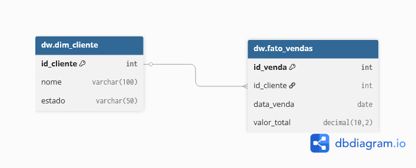

# DW – Segmentação de Clientes (Curva ABC)

Projeto de Data Warehouse desenvolvido para simular um cenário real de análise de receita. O objetivo é classificar clientes de acordo com sua representatividade no faturamento usando a metodologia de Curva ABC, aplicada sobre um modelo dimensional simples (Star Schema) em SQL Server.

---

## Contexto do Problema

Empresas que trabalham com múltiplos clientes precisam identificar rapidamente quais deles concentram a maior parte da receita. Sem essa visão, decisões de retenção, campanhas e prioridade de atendimento acabam sendo tomadas sem critério.

Este projeto resolve isso com uma pipeline analítica simples: dados de vendas são carregados em um DW, processados com Window Functions e classificados em três classes (A, B e C) com base no percentual acumulado de receita.

---

## Arquitetura

**Banco de Dados:** SQL Server  
**Schema:** `dw`  
**Modelagem:** Star Schema (Fato + Dimensão)

```
dw.dim_cliente   →   dimensão de clientes
dw.fato_vendas   →   fato de vendas com chave estrangeira para dim_cliente
```



---

## Estrutura dos Arquivos

```
├── 00_create_database.sql    # Criação do banco de dados
├── 01_create_structure.sql   # Schema e tabelas
├── 02_insert_data.sql        # Dados simulados
├── 03_receita_por_cliente.sql # Receita total por cliente
└── 04_curva_abc.sql          # Classificação ABC com percentual acumulado
```

---

## Lógica da Curva ABC

A classificação é feita com base no percentual acumulado de receita, ordenando os clientes do maior para o menor faturamento:

| Classe | Critério |
|--------|----------|
| A | Até 70% da receita acumulada |
| B | Entre 70% e 90% |
| C | Acima de 90% |

A query principal usa CTE + Window Functions para calcular a receita acumulada e o percentual sem necessidade de subqueries aninhadas:

```sql
WITH receita_cliente AS (
    SELECT
        c.id_cliente,
        c.nome,
        SUM(v.valor_total) AS receita_total
    FROM dw.fato_vendas v
    JOIN dw.dim_cliente c ON v.id_cliente = c.id_cliente
    GROUP BY c.id_cliente, c.nome
),
receita_acumulada AS (
    SELECT
        id_cliente,
        nome,
        receita_total,
        SUM(receita_total) OVER (ORDER BY receita_total DESC) AS receita_acumulada,
        SUM(receita_total) OVER ()                            AS receita_geral
    FROM receita_cliente
)
SELECT
    nome,
    receita_total,
    receita_acumulada,
    CAST(receita_acumulada * 100.0 / receita_geral AS DECIMAL(10,2)) AS percentual_acumulado,
    CASE
        WHEN receita_acumulada * 100.0 / receita_geral <= 70 THEN 'Classe A'
        WHEN receita_acumulada * 100.0 / receita_geral <= 90 THEN 'Classe B'
        ELSE 'Classe C'
    END AS classificacao_abc
FROM receita_acumulada
ORDER BY receita_total DESC;
```

---

## Técnicas Utilizadas

- Modelagem dimensional (Star Schema)
- JOIN entre fato e dimensão
- GROUP BY com agregação
- CTE (Common Table Expression)
- Window Functions — `SUM() OVER()`
- Cálculo de percentual acumulado
- Classificação condicional com `CASE`

---

## Como Executar

1. Ter o SQL Server instalado (ou usar o SQL Server Express / Azure Data Studio)
2. Executar os arquivos na ordem numérica:
   ```
   00 → 01 → 02 → 03 → 04
   ```
3. O resultado final da Curva ABC estará na saída do arquivo `04_curva_abc.sql`

---

## Autor

**Raul Adriano**  
[github.com/rauladrixdev](https://github.com/rauladrixdev)
